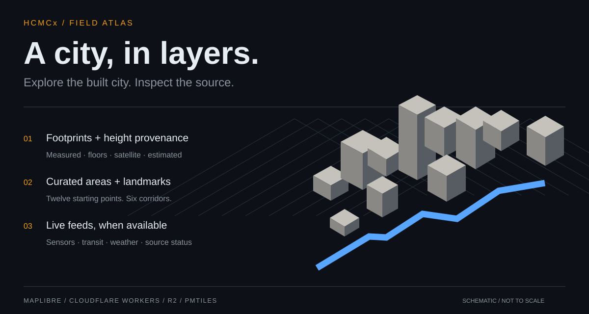
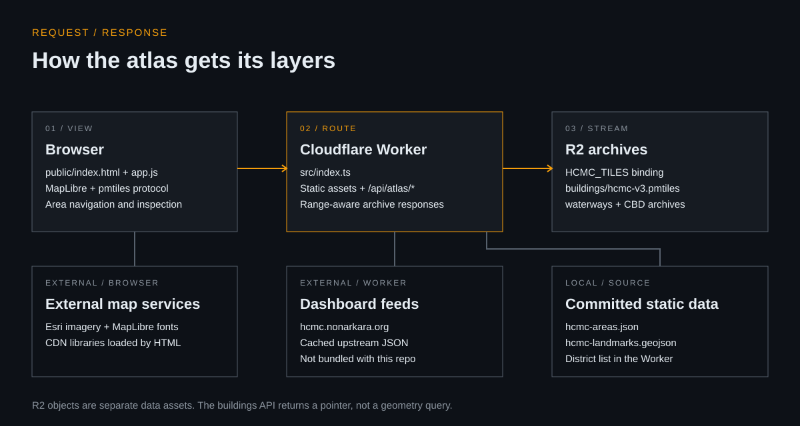

# HCMCx 3D Atlas

**Explore Ho Chi Minh City block by block, with the source behind every layer.**



A MapLibre-based 3D city viewer with a small Cloudflare Worker API. Jump between 12 curated areas and six corridors, inspect building height provenance, and overlay transit and civic feeds from the companion HCMC dashboard.

The frontend is plain HTML, CSS, and JavaScript. The Worker serves static assets, streams PMTiles from R2 with HTTP byte ranges, and exposes a JSON mirror for scripts and other clients.

> **Readiness:** the source and offline checks are self-contained. A complete 3D city is not: large PMTiles archives are not in Git, and live feeds and map imagery are external. A fresh checkout does not reproduce the production dataset. See [setup and data requirements](docs/SETUP.md).

## Start locally

Use Node.js 24 (the version in `.nvmrc`) and npm. No Cloudflare login is needed for the local config.

```bash
git clone https://github.com/Nonarkara/hcmc-3d-atlas.git
cd hcmc-3d-atlas
npm ci --ignore-scripts
npm run verify
npm test
npm run typecheck
npm run dev
```

Open the address printed by Wrangler, normally `http://localhost:8787`. `npm run dev` explicitly uses local bindings and `wrangler.local.toml`, which has no account, custom domain, or cron. The application can still request external map assets and live feeds when you open it. Use the offline tests instead if you need zero external calls.

Without local R2 archives, tile requests return `404`; the application shell and curated-data API are available, but the building layer is incomplete. You can inspect these routes without asking for live dashboard data:

```bash
curl http://localhost:8787/api/atlas/areas
curl http://localhost:8787/api/atlas/corridors
curl http://localhost:8787/api/health
```

`health.ok` means the handler ran; inspect `health.pmtiles.available` separately. [Load your local tile archives →](docs/SETUP.md#bring-your-own-tile-archives)

## What is here

- **City exploration:** 12 area presets, six corridors, camera movement, layer controls, and a building inspection panel
- **3D rendering:** PMTiles building footprints, waterways, curated landmark GeoJSON, and height-source labels; the client uses metres without visual height multipliers
- **Civic context:** upstream-backed sensors, weather, air quality, events, and transit; availability and freshness depend on the companion dashboard
- **Machine-readable surface:** JSON routes for areas, corridors, static districts, point inspection, nearby transit, feed status, and archive discovery
- **Embedding:** a postMessage handshake and a restricted list of parent origins in [`public/app.js`](public/app.js)

This is an exploratory civic visualization. Rounded static district statistics, estimated building heights, missing feed values, and derived risk scores are not authoritative planning or emergency guidance.

## How it fits together



Read the [architecture and API guide](docs/ARCHITECTURE.md) for the source locations behind each connection, local versus external routes, and data caveats.

## Repository map

```text
public/                  Static viewer, styles, curated areas and landmark footprints
src/index.ts             Worker router, R2 range streaming, upstream adapters, JSON APIs
scripts/verify-local.mjs  Dependency-free text/data sanity checks
scripts/bake-buildings.py  Offline data-preparation workflow with large remote inputs
test/worker.test.mjs      Offline Worker contract tests with fake R2 and blocked network
wrangler.local.toml      Isolated local development bindings
wrangler.toml            Maintainer's production account/domain/bucket configuration
docs/                    Setup, architecture, and original editable SVGs
```

## Checks

| Command | What it checks | External services? |
| --- | --- | --- |
| `npm run verify` | Committed data and source invariants; not a compiler | No |
| `npm test` | Worker routing, curated data, missing tiles, R2 byte ranges, CORS | No; network is blocked in tests |
| `npm run typecheck` | Worker TypeScript | No |
| `npm run build:check` | Wrangler bundle dry run, no upload | No live data required |
| `npm run smoke` | Served source markers and real tile range responses | Defaults to production |
| `npm run smoke:api` | End-to-end API and live-feed expectations | Defaults to production |

The smoke commands are **not** part of the offline quickstart. Setting `ATLAS_BASE` or `ATLAS_URL` to localhost changes the target, but live-data endpoints still call the companion dashboard. See [verification notes](docs/VERIFICATION.md) for checks actually run.

## Before deploying or redistributing

- `npm run deploy` and `npm run deploy:live` are production-affecting commands. The checked-in production config belongs to the maintainer. Review your own account, domain, R2 objects, data terms, and billing before any deployment
- The baking script currently emits a **v2** archive while the Worker expects a **v3** object key. This is documented, not hidden behind a one-command deployment claim
- Preserve the attribution for OpenStreetMap, Overture source contributors, Google height data, GHSL/JRC, and map providers where applicable. Dataset terms are separate from code terms
- No repository-wide license is currently included. Public visibility is not a license grant; ask the maintainer before reuse or redistribution

[Local setup](docs/SETUP.md) · [Architecture and API](docs/ARCHITECTURE.md) · [Verification](docs/VERIFICATION.md)
